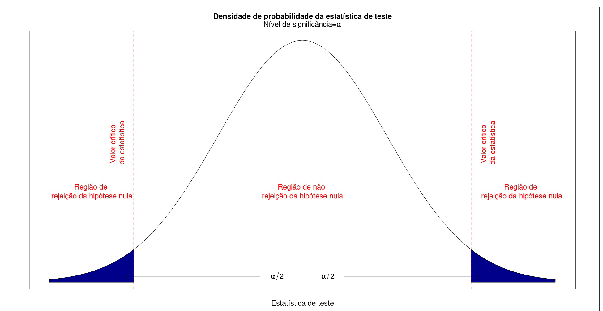
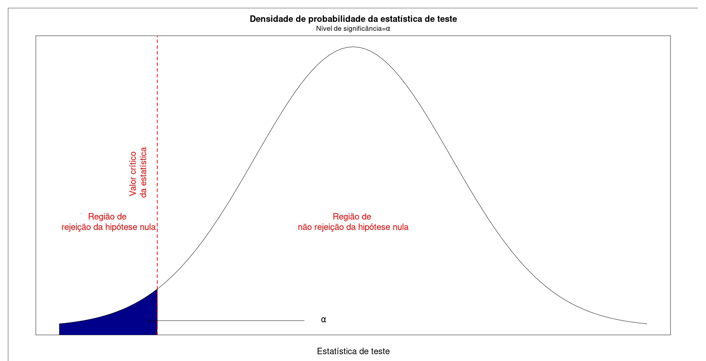
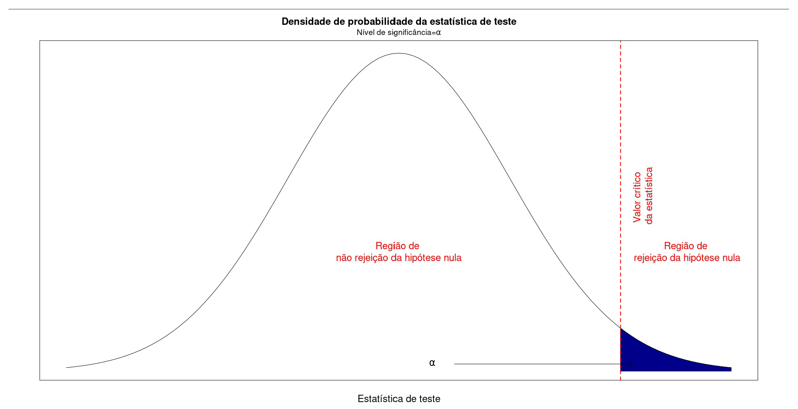
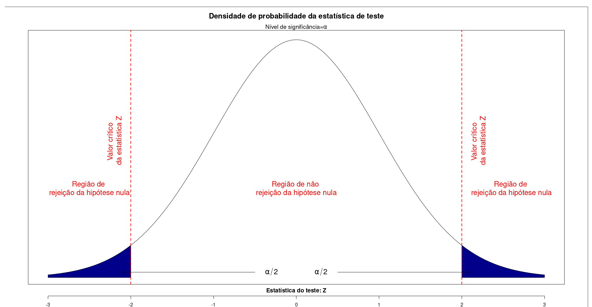
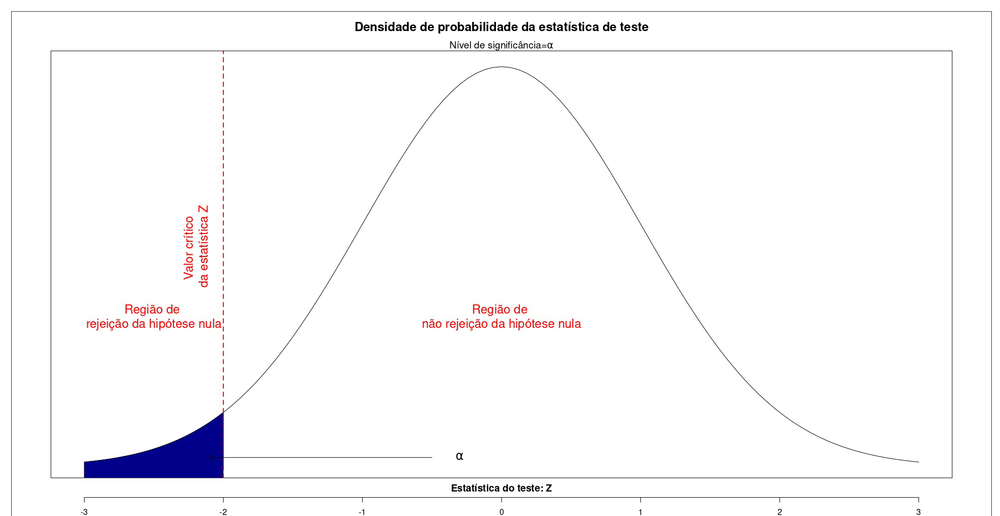
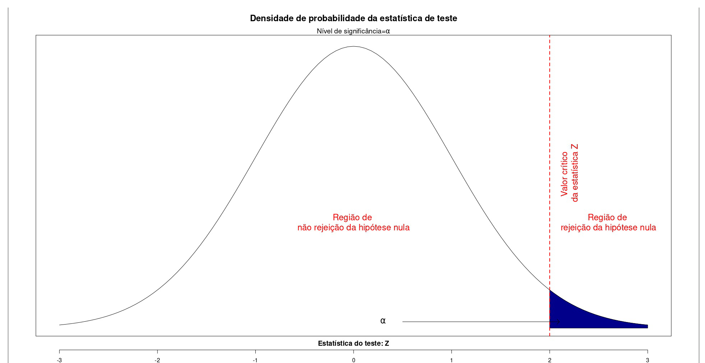
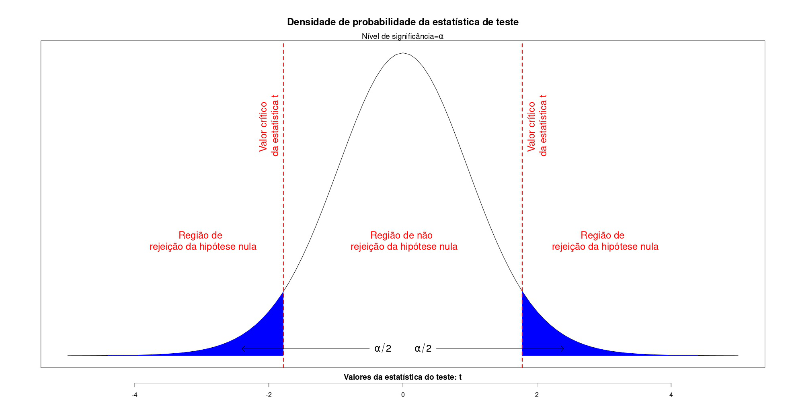
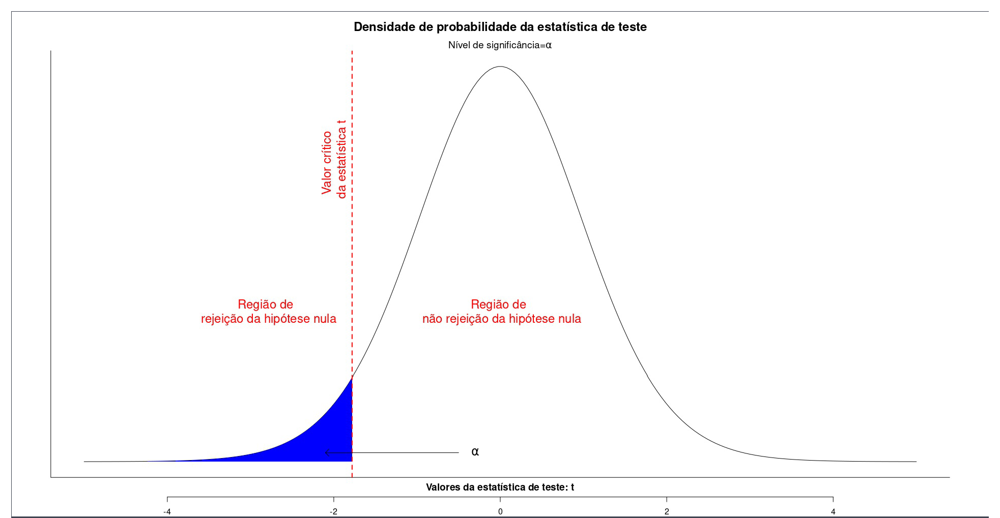
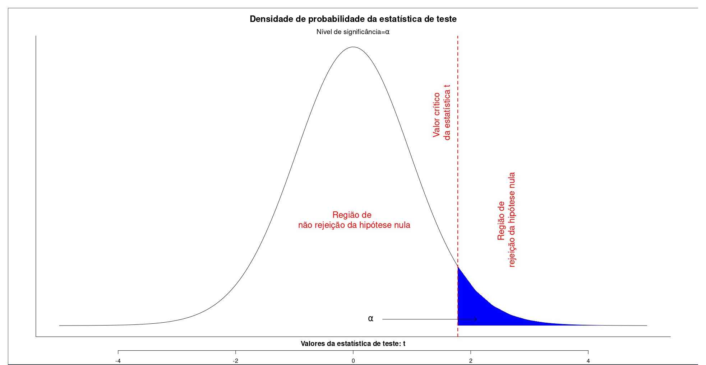
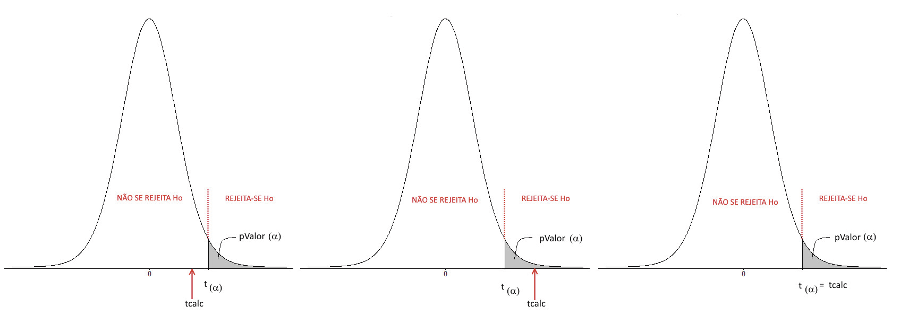

<style>
body {
text-align: justify}
</style>

```{r setup, include=FALSE}
library(knitr)
```

```{r, include = FALSE}
knitr::opts_chunk$set(
  collapse = TRUE,
  comment = "#>"
)
```

```{=html}
<style>
div.blue { background-color:#e6f0ff; border-radius: 5px; padding: 20px;}
</style>
```
```{=html}
<style>
div.gray { background-color:#afb5bd; border-radius: 5px; padding: 20px;}
</style>
```
<center>

</center>

[1. População (universo) & amostra:]{style="color:darkblue"}
------------------------------------------------------------

Quase que invariavelmente, em todo ramo de conhecimento, o pesquisador esbarra em limitações das mais variadas ordens (econômica, técnica, ética, geográfica, temporal,...) que impossibilitam a coleta e estudo dos dados e informações associados a todos os casos existentes relacionado ao objeto de sua pesquisa (*população* ou *universo*).

Por essa razão, através de um procedimento estatístico denominado de *amostragem*, estuda-se uma *população* ou *universo* a partir de uma *amostra*.

_Amostra_ é um subconjunto finito e representativo da população ou universo, extraído de modo sistemático (planejado).

É comum a adoção de letras gregas para as características (parâmetros) que se referirem ao universo amostral (população) e letras do alfabeto latino para aquelas relativas (estatísticas) à amostra extraída:

+---------------------+----------------------------------+--------------------------------+
| Característica      | Notação populacional (parâmetro) | Notação amostral (estatística) |
+=====================+==================================+================================+
| Número de elementos | N                                | n                              |
+---------------------+----------------------------------+--------------------------------+
| Média               | $\mu$                            | $\stackrel{-}{x}$              |
+---------------------+----------------------------------+--------------------------------+
| Variância           | $\sigma^{2}$                     | ${s}^{2}$                      |
+---------------------+----------------------------------+--------------------------------+
| Desvio padrão       | $\sigma$                         | s                              |
+---------------------+----------------------------------+--------------------------------+
| Proporção           | $\pi$                            | p                              |
+---------------------+----------------------------------+--------------------------------+

: Notação utilizada

[2. Inferência estatística e testes de hipóteses:]{style="color:darkblue"}
--------------------------------------------------------------------------

Inferência: inferência estatística é o procedimento de extrair conclusões sobre uma população a partir de uma amostra de itens retirados desta população.

Estimação: construção de um modelo que apresenta as características e parâmetros de uma população que, na maior parte das vezes, são desconhecidos. A estimação desses parâmetros é feita então, a partir de uma amostra aleatória da população e, através das técnicas de estimação de parâmetros, procura-se obter uma estimativa do parâmetro de interesse e associar a ela uma probabilidade de que esteja correta.

Estimador são modelos teóricos construídos para serem aplicados a amostras extraídas de modo aleatório de uma população sob estudo para estimar parâmetros que dela desconhecem: média, variância, proporção e outros.

Algumas das propriedades desejáveis de um bom estimador:


*  Convergência (deve ser consistente);  
*  Centrado (não deve enviesado);  
*  Eficiência.


Estatísticas (estimativas) são os resultados obtidos pela aplicação de estimadores de parâmetros a amostras extraídas de modo aleatório da população sob estudo.

Parâmetros são características (desconhecidas) de uma população que definem sua distribuição de probabilidades:


*  Distribuição Normal: média e desvio padrão ($\mu$ e $\sigma$);
*  Distribuição Gama: forma e escala ($\alpha$ e $\beta$);
*  Distribuição Binomial: a probabilidade de Bernoulli ($p$).

+-----------------------------+------------------------------------------------------------------------------------------+
|  Parâmetro populacionaç     |  Estatística amostral                                                                    |
+=============================+==========================================================================================+
| $\mu = E[X]$                | $\stackrel{-}{X}=\frac{1}{n}\times\sum _{\stackrel{.}{i}=1}^{n}{X}_{i}$                  |
+---------------------+----------------------------------+---------------------------------------------------------------+
| $\sigma^{2}=E[(X-\mu)^{2}]$ | $S^{2} = \frac{1}{n-1} \times  \sum _{i=1}^{n}{\left({X}_{i}-\stackrel{-}{X}\right)}^{2}$|
+---------------------+----------------------------------+---------------------------------------------------------------+
| $\sigma = \sqrt{\sigma^{2}}$|$S =\sqrt{\frac{1}{n-1}\times\sum _{i=1}^{n}{\left({X}_{i}-\stackrel{-}{X}\right)}^{2}}$  |
+---------------------+----------------------------------+---------------------------------------------------------------+

: Parâmetros \& Estatísticas 

Em muitos processos de investigação científica é frequente ao pesquisador formular perguntas que deverão ser apropriadamente respondidas.


*  comparar esses resultados a outros valores; ou,  
*  comparar resultados obtidos pela aplicação de diferentes métodos (ou produtos, valores de médias, variâncias, ...) observados em diferentes amostras.

Testes de hipóteses (ou de significância): Formulação de hipóteses que permitem fazer inferências sobre características da população (quando feitos sobre os parâmetros da população são chamados de Testes paramétricos).

Uma hipótese estatística é uma suposição feita sobre uma determinada característica da população sob estudo (o parâmetro), que subsiste (perdura, sobrevive, permanece incontestável) até que haja alguma informação estatisticamente relevante, para contradizê-la.

A teoria científica não é mais do que uma hipótese; uma conjectura que um dia será refutada e substituída por outra.

Um teste de hipóteses refere-se, portanto, aos procedimentos formais utilizados por estatísticos na problemática acima.

A conclusão de um teste de hipóteses resume-se a: aceitar a hipótese ou rejeitá-la. Muitos estatísticos não adotam a expressão aceitar uma hipótese preferindo, no lugar, usar a expressão não rejeitar a hipótese a um certo nível de significância.

Por que essa distinção entre aceitar e não rejeitar?

Ao se usar a expressão aceitar pode haver uma pré-concepção de que a hipótese é verdadeira.

A expressão não rejeitar salienta que a informação trazida pelos dados não foi suficientemente robusta para que pudéssemos abandonar essa hipótese em favor de outra.

Alguns dizem que os estatísticos não se perguntam qual a probabilidade de estarem certos. mas de estarem errados.

Um teste de hipóteses guarda uma certa semelhança a um julgamento. Caso não haja indício forte o suficiente que comprove a culpa do acusado ele é declarado como inocente inocente (mesmo que não o seja de fato).

No contexto estatístico, o  indício que nos permite rejeitar uma hipótese provem da análise de informações trazidas (amostra da população) convertida para alguma métrica (estatística).

O objetivo de um teste de hipóteses é pois o de tomar uma decisão, no sentido de verificar se existem razões para rejeitar ou não a hipótese nula. Esta decisão é baseada na informação disponível, obtida a partir de uma amostra, que se recolhe da população.

Através de um teste de hipóteses entre os valores observados em duas amostras extraídas das populações investigadas a estatística consegue associar um nível de significância na tomada de decisão, de modo a minimizar a chance de erro ($\alpha$) de se concluir pela rejeição de uma hipótese verdadeira previamente formulada.

Testes de hipóteses são regras de decisão que nos possibilitam rejeitar ou não, probabilisticamente (associado a um nível de significância), determinada suposição acerca do parâmetro da população estudada, baseados em uma distribuição de densidade de probabilidades apropriada.

Pretende-se verificar se uma das hipóteses a que damos mais importância, é sustentada ou rejeitada pela informação recolhida da amostra.

Nível de significância ($\alpha$) é estabelecido pelo pesquisador (baseado tanto na expertise dele quanto no campo a que o estudo pertence) antes do experimento ser realizado e corresponde ao grau de risco que se deseja incorrer ao se rejeitar uma hipótese nula quando ela é verdadeira.

Nível de confiança ($1-\alpha$) é a medida da confiabilidade de nossa conclusão no teste de hipóteses.

A hipótese nula  é a hipótese que reflete a situação em que não há mudança, sendo pois uma hipótese conservadora e é aquela em que temos mais confiança (resultado de uma experiência passada). Inicialmente ela é assumida como verdadeira. Em seguida, considera-se se a informação amostral trazida é consistente consistente com o que essa hipótese afirma:

*  caso sejam, tudo o que pode ser feito é manter a hipótese inicial; e,
*  caso não sejam consistentes com o que a hipótese nula afirma analisa-se quão improvável podem ser além de uma dúvida razoável (nível de significância).


"Em relação a qualquer experimento nós devemos falar dessa hipótese como a hipótese nula, e deve-se salientar que a  hipótese nula nunca é provada ou estabelecida; mas é, possivelmente, refutada, no curso da experimentação. Todo experimento, deve ser afirmado, existe apenas para dar aos fatos uma chance de refutar a hipótese nula [...]" Ronald Aylmer Fisher 

[3. Roteiro elementar para a realização de um teste de hipóteses:]{style="color:darkblue"}
------------------------------------------------------------------------------------------


* O pesquisador deve delimitar o objeto de sua pesquisa;
* Identificar o modelo de probabilidade do estimador do parâmetro da população que se estuda;  
* Identificar a estatística apropriada para o teste em razão das informações disponíveis acerca da população, do tamanho da amostra e sua independência (escore médio, proporção, estatística t, escore z, estatística F, $\chi$) descritos no plano de análise;
* Enunciar as hipóteses: as hipóteses são apresentadas de tal maneira que sejam mutuamente exclusivas; o que afirmado por uma deve ser contradito pela outra; e,
* As hipóteses são comumente denominadas de hipótese nula ($H_{0}$) e alternativa ($H_{1}$) sendo a primeira aquela que se deseja rejeitar frente à segunda,  ao nível de significância estabelecido, em decorrência de alguma evidência trazida pelo estudo.  
* Estabelecer um nível apropriado para a significância $\alpha$ (em alguns campos do conhecimento níveis de significância muito reduzidos são impraticáveis);
* Determinar na curva de densidade de probabilidade do modelo da estatística de teste a(s) região(ões) crítica(s): faixa(s) de valores da estatística que nos levam à rejeição ou não da hipótese $H_{0}$ em função do nível de significância previamente arbitrado pelo pesquisador $\alpha$;
* Calcular a estimativa do parâmetro e o valor da estatística do teste com base na amostra extraída;
* Concluir com base nos resultados analisados: se estatística do teste   pertence à(s) região(ões) crítica(s) de sua distribuição teórica, rejeitar $H_{0}$; caso contrário não há evidências estatisticamente significativas para rejeitá-la.


[4. Formulação e estruturação de um teste de hipóteses:]{style="color:darkblue"}
--------------------------------------------------------------------------------


* Uma boa hipótese deve ser baseada em uma boa pergunta sobre o objeto do estudo;
* Deve ser simples e específica; e,
* Deve ser formulada na fase propositiva da pesquisa e não após a coleta de dados (_post hoc}).
* A hipótese nula ($H_{0}$) que será testada a um nível de significância ($\alpha$) é, em geral, de concordância com o parâmetro que se estuda da população e baseada em conhecimento prévio; e,
* A hipótese alternativa ($H_{1}$) é contrária, oposta, antagônica à hipótese nula.


[5. Natureza dos erros envolvidos em um teste de hipóteses:]{style="color:darkblue"}
------------------------------------------------------------------------------------

O pensamento estatístico da primeira metade do século XI tem seu interesse voltado à solução dos problemas de testes de hipóteses. Referências vagas à significância datam dos séculos XVIII e XIX. Em 1900, Karl Pearson utiliza o conhecido teste qui-quadrado. Porém, somente em 1928 são introduzidos os conceitos de erro de primeira e segunda espécies, por Jerzy Neyman e Egon S. Pearson (filho de Karl).


+---------------------------+-------------------------------------------+---------------------------------------------+
| Realidade (desconhecida)  | Não rejeitar $H_{0}$                      | Rejeitar $H_{0}$                            |
+===========================+===========================================+=============================================+
| $H_{0}$ verdadeira        | Decisão correta (probabilidade=1-$\alpha$)| Erro do tipo I (probabilidade=$\alpha$)     |
+---------------------------+-------------------------+-----------------+---------------------------------------------+
|  $H_{0}$ falsa            | Erro do tipo II (probabilidade=$\beta$)   | Decisão correta (probabilidade=1-$\beta$)   |
+-----------------------------------------------------------------------+---------------------------------------------+

: Tabela de decisão para escolha entre duas hipóteses


Onde:


*  $\alpha$ é a probabilidade de se cometer um _erro do tipo I}: rejeitar a hipótese nula sendo ela verdadeira (arbitrado pelo pesquisador, é denominado nível de significância do teste); 
*  $\beta$ é a probabilidade de se cometer um _erro do tipo II}: não rejeitar a hipótese nula sendo esta falsa;
* (1-$\alpha$) é o nível de confiança de nossa decisão, a probabilidade associada em não se rejeitar a hipótese nula ($H_{0}$) sendo ela de fato verdadeira; e,
* (1-$\beta$) é o ``poder do teste'', a probabilidade associada em não se aceitar a hipótese nula ($H_{0}$) quando ela é de fato falsa.

Como vimos no quadro acima há dois tipos de erros envolvidos em um teste de hipóteses e suas consequências, muitas vezes, são bem diferentes.


* Erro do tipo I: rejeitar a hipótese nula quando ela é verdadeira ; ou,
* Erro do tipo II: não rejeitar a hipótese nula quando é falsa. 

Por exemplo, se alguém testa a presença de alguma doença em um paciente, decidindo incorretamente sobre a necessidade do tratamento (ou seja, decidindo que a pessoa está doente), pode submetê-lo ao desconforto pelo tratamento (efeitos colaterais) além de perda financeira pela despesa incorrida.

Mas por outro lado, a falha em diagnosticar a presença da doença no paciente pode levá-lo à morte pela ausência de tratamento.

Outro exemplo clássico a ser citado seria o de condenar uma pessoa inocente ou libertar um criminoso.

Um erro do tipo I ocorre quando o pesquisador rejeita uma hipótese nula quando é verdadeira. A probabilidade (limitada pelo pesquisador) de se incorrer em um erro do tipo I é chamada de nível de significância, sendo frequentemente denotada pela letra grega $\alpha$.

Um erro do tipo II ocorre quando o pesquisador não rejeita uma hipótese nula que é falsa. A probabilidade de cometer um erro do tipo II, também chamada de poder do teste é frequentemente denotada pela letra grega $\beta$.

É desejável conduzir o teste de um modo a manter a probabilidade de ambos os tipos de erro em um mínimo, o que não é possível se o número de observações for pré-estabelecido.

[6. Regras para a tomada de decisão :]{style="color:darkblue"}
--------------------------------------------------------------

O plano de análise inclui regras de decisão para se rejeitar ou não a hipótese nula. Na prática essas regras de decisão são verificadas pela comparação dos valores calculados da estatística apropriada para o teste com valores críticos tabelados, condizentes ao nível de significância estabelecido, facilitado se visualizado no gráfico da densidade de probabilidade da distribuição da estatística do teste.

No gráfico de densidade de probabilidades da estatística do teste temos uma região de não rejeição, um intervalo de valores no qual, se a estatística de teste estiver contida, a hipótese nula não será rejeitada.

A região de não rejeição é formada de modo que a probabilidade de se incorrer em um erro Tipo I seja igual ao nível de significância $\alpha$ estipulado pelo pesquisador. Essa região de não rejeição apresenta uma probabilidade igual ao nível de confiança $1-\alpha$.

Se a estatística do teste estiver fora da faixa de valores delimitada na  região de não rejeição a hipótese nula poderá ser rejeitada no nível de significância $\alpha$.

Com a popularização dos programas estatísticos computacionais, a probabilidade exata associada ao valor da estatística calculada para teste passou ser neles apresentada de modo default, nominada pela expressão  Valor P (p-Value) que expressa uma probabilidade.

Para melhor entender o  Valor-P' (p-value) suponha que a estatística de teste seja igual a S.

O  Valor P é a probabilidade de observar uma estatística de teste com valor tão extremo quanto S, assumindo que a hipótese nula é verdadeira.

Se o Valor P, uma probabilidade como dissemos acima, for menor que o nível de significância estipulado pelo pesquisador, pode-se rejeitar a hipótese nula ao nível de significância $\alpha$.

[7. Teste de hipóteses Bilateral (tipo: diferente de):]{style="color:darkblue"}
-------------------------------------------------------------------------------

Teste bilateral (tipo: diferente de), figura 1:


\begin{cases}
    H_{0}: \mu = \mu_{0}\\
    H_{1}: \mu \ne \mu_{0}\\
\end{cases}


$\alpha$: é o nível de significância adotado para o teste  
$\mu$:  o parâmetro que se deseja testar frente ao valor alternativo $\mu_{0}$


<center>

<figcaption>Fig. 1: Teste bilateral</figcaption>
</center>


[8. Teste de hipóteses Unilateral à esquerda (tipo: menor que):]{style="color:darkblue"}
----------------------------------------------------------------------------------------

Teste unilateral à esquerda (tipo: menor que), figura 2:


\begin{cases}
    H_{0}: \mu \ge \mu_{0}\\
    H_{1}: \mu < \mu_{0}\\
\end{cases}


$\alpha$: é o nível de significância adotado para o teste  
$\mu$: o parâmetro que se deseja testar frente ao valor alternativo $\mu_{0}$  


<center>

<figcaption>Fig. 2: Teste unilateral á esquerda</figcaption>
</center>


[9. Teste de hipóteses Unilateral à direita (tipo: maior que):]{style="color:darkblue"}
---------------------------------------------------------------------------------------

Teste unilateral à direita (tipo: maior que), figura 3:


\begin{cases}
    H_{0}: \mu \le \mu_{0}\\
    H_{1}: \mu > \mu_{0}\\
\end{cases}

$\alpha$: é o nível de significância adotado para o teste  
$\mu$: o parâmetro que se deseja testar frente ao valor alternativo $\mu_{0}$


<center>

<figcaption>Fig. 3: Teste unilateral à direita</figcaption>
</center>

[10. Testes de hipóteses para uma população:]{style="color:darkblue"}
---------------------------------------------------------------------

### <span style="color:darkblue">10.1 Testes de hipóteses para a média de uma população:</span>


Estruturas possíveis dos testes de hipóteses para uma média:

Teste bilateral (tipo: diferente de):


\begin{cases}
    H_{0}: \mu = \mu_{0}\\
    H_{1}: \mu \ne \mu_{0}\\
\end{cases}


Teste unilateral à esquerda (tipo: menor que):


\begin{cases}
    H_{0}: \mu \ge \mu_{0}\\
    H_{1}: \mu < \mu_{0}\\
\end{cases}

Teste unilateral à direita (tipo: maior que):


\begin{cases}
    H_{0}: \mu \le \mu_{0}\\
    H_{1}: \mu > \mu_{0}\\
\end{cases}


Situações possíveis:


* Variância populacional conhecida;
* Variância populacional desconhecida mas o tamanho da amostra é grande ($n\ge 30$); e,
* Variância amostral desconhecida com pequenas amostras ($n < 30$).

Estatística do teste para a primeira situação: variância populacional conhecida:


$$
Z = \frac{\stackrel{-}{X} - \mu_{0}}{\frac{\sigma}{\sqrt{n}}} \sim N(0,1)
$$ 

onde:

* $\stackrel{-}{X}$ é a média observada na amostra  
* $\mu_{0}$ o valor (desconhecido) inferido à média populacional, a ser testado frente à média amostral observada\newline
$\sigma$ é o desvio padrão populacional  
* $n$ é o tamanho da amostra 

Estatística do teste para a segunda situação: variância populacional desconhecida mas amostras grandes ($n\ge30$): $S$ pode ser tomada como estimativa de $\sigma$:

$$
Z = \frac{\stackrel{-}{X} - \mu_{0}}{\frac{S}{\sqrt{n}}}   \sim N(0,1)
$$ 

onde:

* $\stackrel{-}{X}$ é a média observada na amostra  
* $\mu_{0}$ o valor (desconhecido) inferido à média populacional a ser testado frente à média amostral observada
$S$ é o desvio padrão amostral  
* $n$ é o tamanho da amostra 


Estatística do teste para a terceira situação: variância populacional desconhecida e amostras pequenas ($n<30$):

$$
T = \frac{(\stackrel{-}{X} - \mu_{0})}{    \frac{S}{\sqrt{n}} } \sim t_{(n-1)}
$$    

onde:


* $\stackrel{-}{X}$ é a média observada na amostra  
* $\mu_{0}$ o valor (desconhecido) inferido à média populacional, a ser testado frente à média amostral  
* $S$ é o desvio padrão amostral  
* $n$ é o tamanho da amostra


Formulação dos testes com o uso da estatística Z ($Z \sim N(0,1)$):

*  teste de hipóteses bilateral (tipo: diferente de):
$$
P[\left|Z_{calc}\right| \le {Z}_{tab\left(\frac{\alpha }{2}\right)}|\mu=\mu_{0}]=(1-\alpha)
$$

$$
P(-{Z}_{tab\left(\frac{\alpha }{2}\right)} \le  Z_{calc} \le {Z}_{tab\left(\frac{\alpha }{2}\right)}) = (1-\alpha)
$$

*  teste de hipóteses unilateral à esquerda (tipo: menor que): 

$$
P[Z_{calc} \ge -{Z}_{tab\left(\alpha \right)}|\mu \ge \mu_{0}] =(1-\alpha)
$$
$$
P(Z_{calc}  \ge -{Z}_{tab\left(\alpha \right)})=(1-\alpha)
$$

*  teste de hipóteses unilateral à direita (tipo maior que):

$$
P[Z_{calc} \le {Z}_{tab\left(\alpha \right)}|\mu \le \mu_{0}] =(1-\alpha)
$$

$$
P(Z_{calc}  \le {Z}_{tab\left(\alpha \right)})=(1-\alpha)
$$

Regiões de rejeição (regiões críticas) da hipótese nula em um teste bilateral (tipo: diferente de) figura 4:

<center>

<figcaption>Fig. 4: Teste bilateral com a estatística Z</figcaption>
</center>

Região de rejeição (região crítica) da hipótese nula em um teste unilateral à esquerda (tipo: menor que) figura 5:

<center>

<figcaption>Fig.5: Teste unilateral à esquerda com a estatística Z</figcaption>
</center>

Região de rejeição (região crítica) da hipótese nula em um teste unilateral à direita (tipo: maior que) figura 6:

<center>

<figcaption>Fig. 6: Teste unilateral à direita com a estatística Z</figcaption>
</center>

Formulação dos testes com o uso da estatística T (T $ \sim t_{(n-1)}$):


```{=tex}
\begin{itemize}
   *  teste de hipóteses bilateral (tipo: diferente de): 
    \begin{itemize}
        \item []  $ P[\left|t_{calc}\right| \ge {t}_{tab\left(\frac{\alpha }{2};n-1\right)}|\mu=\mu_{0}]=(1-\alpha)$
        \item []  $P(-{t}_{tab\left(\frac{\alpha }{2};n-1\right)} \le  t_{calc}  \le  {t}_{tab\left(\frac{\alpha }{2};n-1\right)})=(1-\alpha)    $
    \end{itemize}   
   *  teste de hipóteses unilateral à esquerda (tipo: menor que): 
    \begin{itemize}
        \item []   $ P[t_{calc} \ge -{t}_{tab\left(\alpha \right)}|\mu \ge \mu_{0}] =(1-\alpha)$  
        \item []  $P( t_{calc}  \ge -{t}_{tab\left(\alpha;n-1\right)}) = (1-\alpha)$ 
    \end{itemize}
   *  teste de hipóteses unilateral à direita (tipo: maior que):
    \begin{itemize}
        \item []  $ P[t_{calc} \le {t}_{tab\left(\alpha \right)}|\mu \le \mu_{0}] =(1-\alpha)$  
        \item []  $P( t_{calc}  \le {t}_{tab\left(\alpha;n-1\right)} ) = (1-\alpha)$ 
    \end{itemize}
\end{itemize}
```


Regiões de rejeição (regiões críticas) da hipótese nula em um teste bilateral (tipo: diferente de), figura 7:

<center>

<figcaption>Fig. 7: Teste bilateral com a estatística T</figcaption>
</center>

Região de rejeição (região crítica) da hipótese nula em um teste unilateral à esquerda (tipo: menor que), figura 8:

<center>

<figcaption>Fig. 8: Teste unilateral à esquerda com a estatística T</figcaption>
</center>

Região de rejeição (região crítica) da hipótese nula em um teste unilateral à direita (tipo: maior que), figura 9:

<center>

<figcaption>Fig. 8: Teste unilateral á direita com a estatística T</figcaption>
</center>

[11. p-Valor:]{style="color:darkblue"}
--------------------------------------

Muitos programas computacionais calculam o pValor em testes estatísticos.

pValor, também chamado nível descritivo do teste, é a probabilidade associada ao valor da estatística do teste de hipóteses no exato ponto da transição da região de não rejeição da hipótese nula ($H_{0}$) para a região de rejeição.

Desse modo duas situações podem ocorrer ao se comparar o pValor com o nível de significância $\alpha$ arbitrado pelo 
pesquisador na análise em curso.

Numericamente pode-se observar:

* pValor > $\alpha$: a estatística calculada será maior que a estatística do pValor e, portanto, dentro da faixa de rejeição de $H_{0}$  
* pValor < $\alpha$: a estatística calculada será maior que a estatística do pValor e, portanto, dentro da faixa de não rejeição de $H_{0}$  
* pValor = $\alpha$: caberá ao pesquisador definir pela rejeição ou não da hipótese nula.  

<center>

</center>

## <span style="color:darkblue">12. Exemplos:</span>

### <span style="color:darkblue">12.1 Exemplo 01:</span>


O tempo de vida útil de uma amostra de 100 lâmpadas fluorescentes produzidas por uma fábrica é calculado como sendo de 1570h com um desvio padrão de 120h. Se $\mu$ é o tempo de vida útil das lâmpadas produzidas pela empresa, teste a hipótese de $\mu=1600h$ contra uma hipótese alternativa de $\mu \neq 1600h$ a um nível de significância de $\alpha=0,05$.


O problema nos pede um teste bilateral (tipo: diferente de):

\begin{cases}
	H_{0}: \mu = \mu_{0} (1600)\\
	H_{1}: \mu \ne \mu_{0}(1600)\\
\end{cases}


Pelo enunciado do problema a variância populacional $\sigma^{2}$ é desconhecida mas, como a amostra é de grande tamanho, podemos tomar $S$ como uma estimativa de $\sigma$ e a estatística do teste fica definida como sendo:

$$
Z = \frac{\stackrel{-}{X} - \mu_{0}}{\frac{S}{\sqrt{n}}}   \sim N(0,1)
$$ 

```{r, fig.height=6, fig.width=9,  fig.align="center"}

# Carregando a biblioteca:
library(f.pack)

# Definindo o algoritmo para a geração de números aleatórios:
library(setRNG)
setRNG(kind="Wichmann-Hill", seed=c(979,1479,1542), normal.kind="Box-Muller")

# Gerando a amostra e definindo as variáveis para o teste: 
dados=rnorm(n=100, mean=1570, sd=120)
sigma=sd(dados)
H0=1600
alfa=0.05

# Cálculo da estatística Z:
z.calc(dados, H0, sigma)

# Valor crítico para a estatística Z:
z.crit(alfa)

# Gráfico para auxiliar a decisão:
z.hip(alfa, dados, H0, sigma)
```

Conclusão: Os resultados obtidos na análise estatística realizada sobre os dados apresentados não nos permitem rejeitar a hipótese de que a duração média populacional das lâmpadas seja igual a 1600h a um nível de confiança de 95\%. 


### <span style="color:darkblue">12.1 Exemplo 02:</span>

Da base de dados ("trutas") relativa ao comprimento em cm de 60 trutas marinhas pesacadas por uma traineira comercial na baía de Delaware na costa leste dos Estados Unidos extraímos uma amostra composta de 10 exemplares. Se $\mu$ é o comprimento médio dessa amostra, teste a hipótese de $\mu=15cm$ contra uma hipótese alternativa de $\mu \neq 15cm$ a um nível de significância de $\alpha=0,025$.

O problema nos pede um teste bilateral (tipo: diferente de):

\begin{cases}
	H_{0}: \mu = \mu_{0} (15)\\
	H_{1}: \mu \ne \mu_{0}(15)\\
\end{cases}


Pelo enunciado do problema nada sabemos sobre a variância populacional $\sigma^{2}$ dessa espécie de peixe e o tamanho da amostra não nos permite tomar $S$ como uma estimativa de $\sigma$. Assim, estatística do teste fica definida como sendo:

$$
T=\frac{(\stackrel{-}{X} - \mu_{0})}{    \frac{s}{\sqrt{n}} } \sim t_{(n-1)}   
$$ 


```{r, fig.height=6, fig.width=9,  fig.align="center"}
# carregando a biblioteca:
library(f.pack)

# Carregando os dados ("trutas"):
base=trutas

# Definindo o algoritmo para a geração de números aleatórios:
library(setRNG)
setRNG(kind="Wichmann-Hill", seed=c(979,1479,1542), normal.kind="Box-Muller")

# Extraído uma amostra aleatória e definindo as variáveis para o teste:

dados=sample(10, x=base$comprimento, replace = FALSE)
H0=15
alfa=0.025

# Cálculo da estatística T:
t_calc(dados, H0)

# Valor crítico para a estatística T:
t_crit(alfa, dados)

# Gráfico para auxiliar a decisão:
t_hip(alfa, dados, H0)
```
Conclusão: Os resultados obtidos na análise estatística realizada sobre os dados apresentados nos permitem rejeitar a hipótese de que o comprimento médio populacional das trautas seja igual a 15cm a um nível de confiança de 97,5\% (é maior). 


